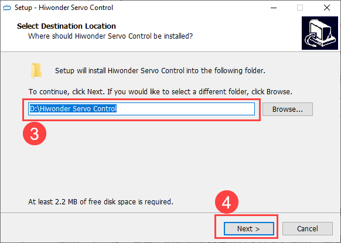
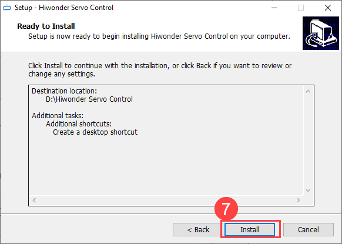
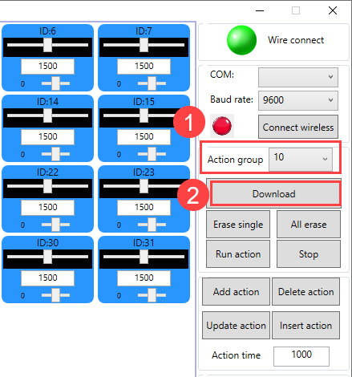

# 3.MP3 Module User Manual

## 3.1 Product Introduction

The MP3 module contains the TF card, which can store hundreds of music and audio files.This facilitates the robot's speech and singing. The module also has a loudspeaker (speaker), which is loud and easy to install. Its user-friendly wiring can provide you a better experience.

:::{Note}

This product needs to be used with a 24-channel or 32-channel servo controller. A 32-channel servo controller is used for demonstration.
:::

## 3.2 Port Instruction

| **Name** | **Function** |
|:---:|:---:|
| RX | Receive pin: receive data. |
| TX | Transmit pin: send data. |
| GND | Ground pin |
| NC | Floating pin: not connected to any other port. |
| 3.3V | Power port: receive 3.3V power supply. |

## 3.3 Product Usage

### 3.3.1 Download Music

(1) Please prepare a card reader before using this module. It is convenient for you to upload music to the TF card. Insert the TF card into the card reader’s slot. Then, connect the card reader to the USB port of your computer.

(2) After connecting it to the computer, the drive pops up in **"My Computer"**. Double-click to enter.

(3) After opening the drive, create a folder named **"mp3"** to store MP3 music. The MP3 module will play the music based on the music in it.

(4) You can drag your favorite music into this folder. Taking MP3 music as an example, after dragging it into the folder, rename the music in the format of four digits **"000X"**. For example, if it is the music 1, rename it to **"0001.mp3"**; if it is the music 10, rename it to **"0010.mp3"**.

(5) If you want to delete or modify the music number, you can also perform this operation in the drive.

### 3.3.2 Connection Instruction

(1) Connect the speaker to the MP3 module. Please ensure that the positive terminal on the speaker is connected to the "spk+" pin on the MP3 module.

(2) After uploading music to the TF card, disconnect the USB connection. Remove the TF card, and insert it into the slot of the MP3 module. Please note that the slot has a spring inside. You should feel a **'click'** sound when the card is successfully inserted.

(3) Connect the MP3 module to the 32-channel servo controller, aligning the pins with the corresponding holes.

## 3.4 PC Software Introduction

### 3.4.1 Setup Hardware Environment

:::{Note}

This product needs to be used with a 24-channel or 32-channel servo controller. A 32-channel servo controller is used for demonstration.
:::

The required materials are shown below:

| Name | Qty |
|:---:|:---:|
| 32-Channel servo controller | 1 |
| MP3 module, including TF card and speaker | 1 |
| USB cable | 1 |
| Battery connection cable | 1 |
| 7.4V lithium battery | 1 |

(1) Please refer to [3.3.2 Connection Instruction]() to connect the MP3 module to the servo controller. The pins must be matched correctly.

(2) Connect the connection cable on the speaker to the MP3 module, as shown below:

(3) Connect the battery connection cable to the power interface on the servo controller, and connect the lithium battery.

:::{Note}

connect the red wire to **"+"**, and the black wire to **"-"**. The positive and negative terminals must be matched correctly.
:::

(4) Connect the servo controller to your PC with the USB cable. Switch the servo controller on.

### 3.4.2 Setup Software Environment

(1) Locate the [Hiwonder Servo Control Steup.exe]() in [Appendix->PC Software](), and double-click to install it.

(2) Install the software according to the installation prompts.

### 3.4.3 Play music

For more detailed instruction on the PC software interface, please access [1.LSC-24 Servo Controller User Manual]().

(1) Connect the PC software to the MP3 module with a USB data cable. Playing music with the MP3 module is realized by calling the action group function in the PC software. Therefore, you need to ensure that the PC software has the corresponding action group. This allows the desired music from the TF card to be played.

(2) Take **"0010.MP3"** in the TF card as an example. Its corresponding action group that needs to be called in the PC software is action group 10. Therefore, before calling the action group, edit an action and download it to action group 10. Let’s add the initial action to the action details list in the PC software.

:::{Note}

If the servo controller connected already has a downloaded action group in the corresponding number, there is no need to download it again. You can proceed to step 4 to directly call the action group to play music.
:::

(3) Select the action group 10 in the action group list. Click the **"Download"** button to download the action to the corresponding number.

(4) After downloading the action group, select the corresponding action group number. Click **"Run action"**. The corresponding music will be played. If you want to stop the music, click the **"Stop"** on the interface. The same steps can be followed for playing others.

